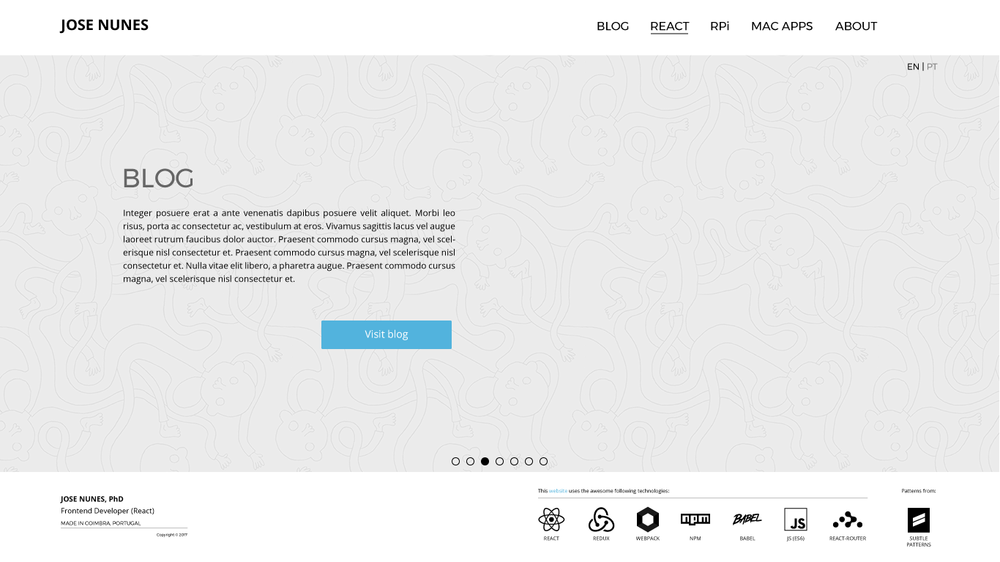
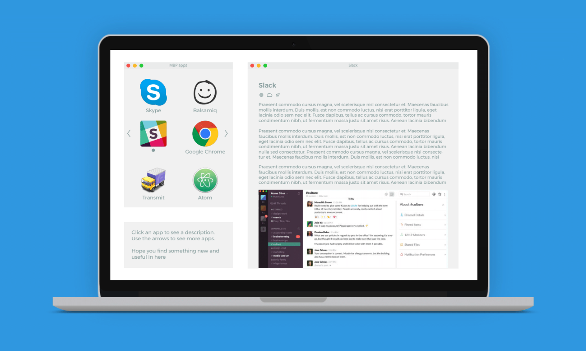
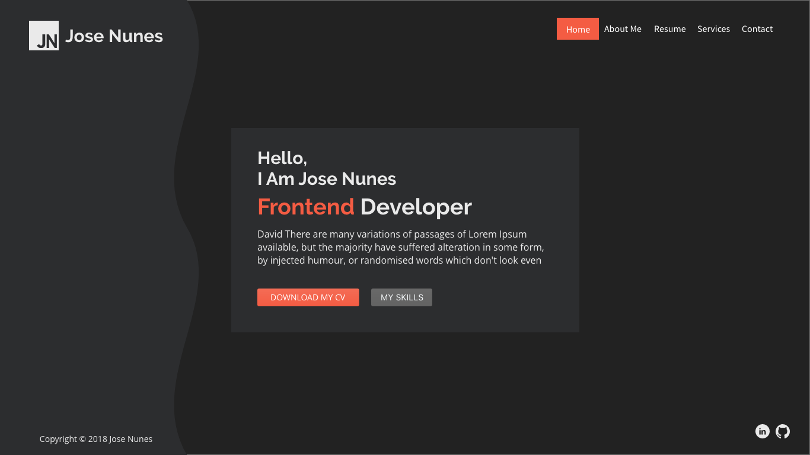
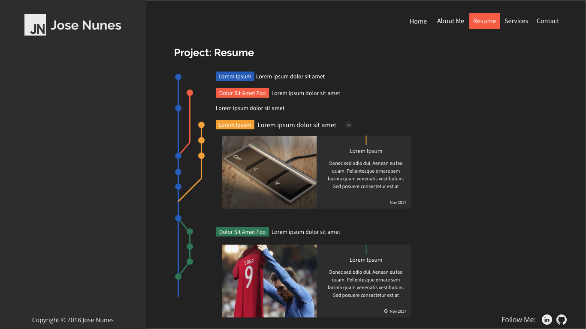

Welcome to josenunes.xyz blog. For a long time, I've been thinking about writing
a personal blog. A blog is, without a doubt, an excellent opportunity to share
and register new exciting things about our industry.

This blog effectively started when I decided to (finally) make a personal
website. Although that was something I wanted for a long time, I never had the
proper commitment to start building it. That is not entirely true. Over the
years, I made several attempts that never got too far, though.

My first serious attempt was in 2016 when inspired by a recent design I worked
on at the time ([this website ➜](http://exchange.ics.uminho.pt/)), I went for a
full page "vibe".

I spent some time designing new ideas for that first version of the website. One
of those was a cool UI to review some of the mac apps I use.

## Version 2

As usual, even considering the time spent designing several screens, I ended up
abandoning the project. It was not until later, in 2018, that I decided to give
it another try. This time, I decided to search for a ready-made template online.
I found
[this one](https://themeforest.net/item/profyl-personal-vcard-resume-html-template/20952362)
from iconic themes.

However, I soon start tackling the design. I ended up designing several screens
(story repeats itself!! 😫). The first change I made was to introduce a dark
theme. Later I redesigned the homepage to suit my personal preference best.

Again, I started thinking about new (crazy) ideas. A good example was the idea
of using a GitGraph to represent my professional record.

## Version 3

Version 3 is the current version of the website. As can be seen from the
previous two images, it shares the same color scheme and dark theme of
version 2. The big difference is the "personality" of the design. The current
version has (at least from my perspective) a "coder personality". The dark
theme, combined with a monospace font (Hack btw, great font), and a more
text-based design, are the factors responsible for it.

I have to say and considering that I'm not a designer, that I'm happy with this
version. In my opinion, it is straightforward but at the same time has a great
personality that I tend to enjoy.

And so, finally I made it, I have a personal website/blog 🎉. Thank you for
checking it!

Cheers 💪!!
